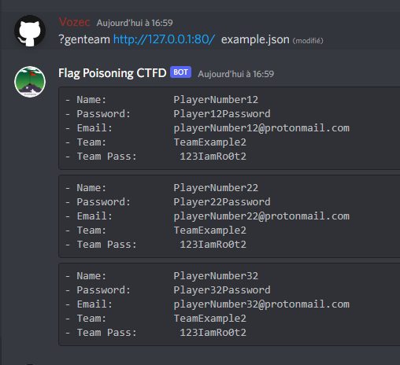
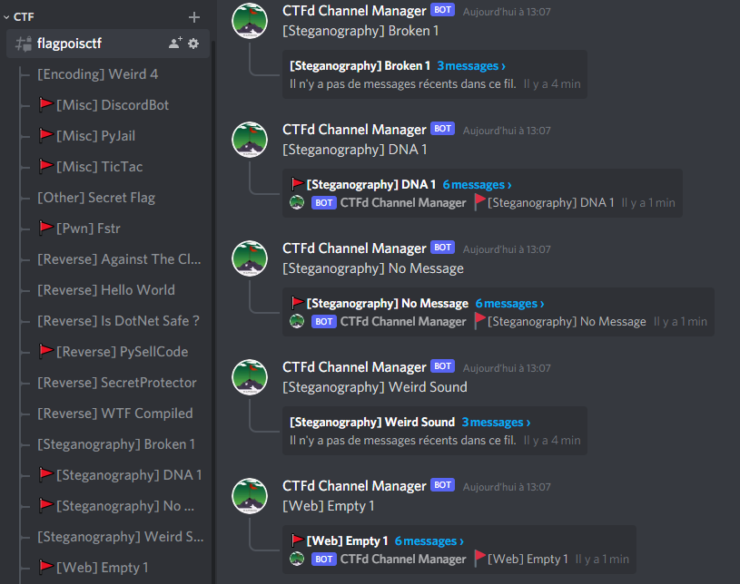
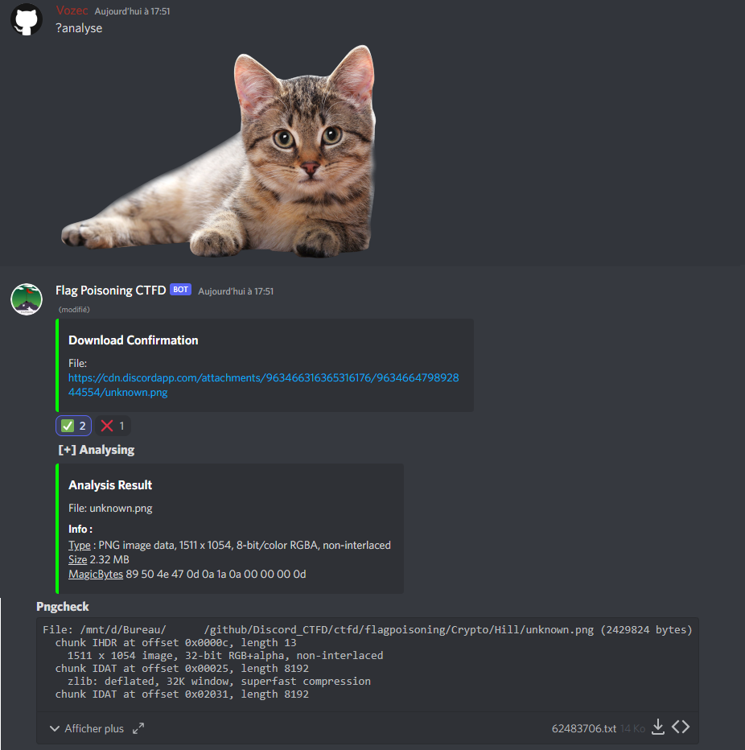

<p align="center">
  
</p>

# Discord bot CTFD-Thread-Parser

# Description:

This tools is used to create automatically discord threads by scraping ctfd plateform and collecting name , category , description and points of challenges.
It can also analyze files with common ctf tools.There are also other useful options such as a team auto-register ,cypher detector or a factoring script for crypto challenges

## Commands :
```
?CreateCTFD <Username> <Password> <Url> <ChannelName>
	|>Create a channel + threads sorted by name

?flagged ThisIsMySuperFlag (in challenge thread)
	|>Store the flag + renamme the challenge thread

?end (in ctfd challenge)
	|>Move the ctfd channel in other category

?gen <url>
	|>Generate new random credentials

?format <Format Flag>
	|>Change format flag

?cypher <hash>
	|>Analyse cypher provided

?facto <number> (optional: <timeout(min)>)
	|>Try to factorize the number provided

?token <mytoken>
	|>Set token account to login & bypass recaptcha

?change
	|>Display menu to change the selected Ctf

?next <days>
	|>Search for futurs ctf on ctftime (default days=7)

?analyse (optional: <link/filename>)
	|>Analyse files of the selected challenges

?help
	|>Display this menu
```

## Usage:
- *?CreateCTFD "The Fool" MyP@ssW0r4!  https://ctf.example.com name_of_channel format_flag*:
- *?genteam http://127.0.0.1:80/  example.json*
- *?facto 1164944854...7013*
- *?next 5*
- *?analyse hiddenflag.png*
- *?cypher SGVsbG9Xb3JsZA==*


## Installation :

```bash
git clone https://github.com/FlagPoisoning/Discord-CTFD-Parser.git
cd Discord-CTFD-Parser
python3 -m pip install -r requirements.txt
apt-get -y -qq install systemctl bash ffmpeg libsndfile1 pip tar file sox nano git unzip sudo wget curl zip gzip ssldump exiftool pngcheck binwalk rubygems ssh stegsnow sox tshark chaosreader strace ltrace checksec  binutils-multiarch;
python3 bot.py
```
*(Don't forget to place your Bot [token](https://discord.com/developers/applications))*

OR using Docker:
```bash
put your discord bot token in ENV Var in the dockerfile
docker build -t discordbot .
```

Config Example for Team Registration :

__Content:__  ./config/example.json
```
{
    "team":"TeamExample",
    "teampwd":"123IamRo0t",
    "users": [
        ["PlayerNumber1","playerNumber1@protonmail.com","Player1Password"],
        ["PlayerNumber2","playerNumber2@protonmail.com","Player2Password"],
        ["PlayerNumber3","playerNumber3@protonmail.com","Player3Password"]
    ]
}
```



## Screenshot:





## Demo :
https://user-images.githubusercontent.com/61807609/154075676-ae335753-e326-44d0-a0cd-261e431caa30.mp4


# TODO server may be an actual http server (can share work remotely)
# TODO or let the client decide if it serves on Internet ?
